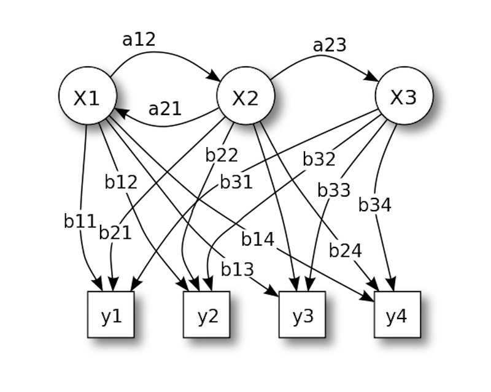
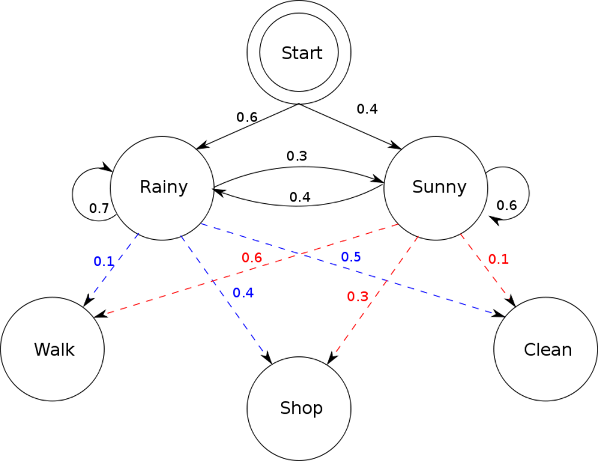

# Hidden Markov Models

## Overview
A **Hidden Markov Model (HMM)** is a statistical **Markov model** in which the system being modeled is assumed to be a Markov process. That is, it is a "memoryless" system whose trajectory is solely determined by its current state. The HMM is considered "hidden" because we do not (or cannot) know about the states of the variable being observed (say, $X$). Hence, we attempt to learn about $X$ by observing $Y$, some sort of observation/event that occurs due to the hidden states. Like all Markov processes, HMM has an additional requirement that the outcome of $Y$ at time $t=t_0$ may be "influenced" **only** by the outcome of $X$ at $t=t_0$ and that the outcomes of $X$ and $Y$ at $t<t_0$ must **not** affect the outcome of $Y$ at $t=t_0$. I.e. the states before the current state have no impact on the future except via the current state. It’s as if to predict tomorrow’s weather you could examine today’s weather but you weren’t allowed to look at yesterday’s weather!

Here is an example of a 3-state **Markov model**:


As we move from state to state (*node to node* or *circle to circle*), there is a **weight** associated with each edge, indicating the probability that we move from one node to another.

A Markov chain is useful when we need to compute a probability for a sequence of observable events. In many cases, however, the events we are interested in are hidden: we don’t observe them directly. For example, we don’t normally observe part-of-speech tags in a text. Rather, we see words and must infer the tags from the word sequence. We call the tags hidden because they are not observed.

HMM's have applications in all sorts of areas including **thermodynamics, economics, speech,  pattern recognition, bioinformatics,** and more. They provide a foundation for probabilistic models of linear sequence ‘labeling’ problems.


## Mathematical Definition(s)
Mathematically, if we consider a sequence of state variables $q_1, q_2, \dots, q_i$ then the **markov assumption** is as follows:
$$
P(q_i=a|q_1, q_2, \dots, q_{i-1}) = P(q_i=a|q_{i-1})
$$
The values of weights (or probabilities) associated with each edge coming off of a state (or node) must sum up to 1. A Markov model has a set of states:
$$
S=\left\{ s_1, s_2, s_3, \dots s_n\right\}
$$
The **Markov process** moves from one state to another generating a sequence of states:
$$
s_{i1}, s_{i2}, s_{i3}, \dots s_{ik} \dots
$$
The following need to be defined for a **Markov model**:
1. **Transition probabilities:**
$$
𝐴 = (𝑎_{ij}), 𝑎_{ij} = 𝑃(𝑠_𝑖,𝑠_𝑗)
$$
2. **Initial Probabilities ($\pi$):**
$$
\pi = \left\{P(s_1), P(s_2), \dots, P(s_i) \right\}
$$
A **hidden** Markov model requires one more mathematical definition. We need to know the probability of observing an event **given** a state:

$$
𝐵=(𝑏_𝑖(𝑣_𝑚)),𝑏_𝑖(𝑣_𝑚)=𝑃(𝑣_𝑚|𝑠_𝑖)
$$
These are known as **emission probabilities**. The probability that given a state, we "emit" to a certain observation.

Given the above, we can alter the graph model above to represent a **hidden** Markov model:

 

## An Example
*The following example problem is pulled from [wikipedia](https://en.wikipedia.org/wiki/Hidden_Markov_model#Weather_guessing_game):*

Consider two friends, Alice and Bob, who live far apart from each other and who talk together daily over the telephone about what they did that day. Bob is only interested in three activities: walking in the park, shopping, and cleaning his apartment. The choice of what to do is determined exclusively by the weather on a given day. Alice has no definite information about the weather, but she knows general trends. Based on what Bob tells her he did each day, Alice tries to guess what the weather must have been like.

Alice believes that the weather operates as a discrete [Markov chain](https://en.wikipedia.org/wiki/Markov_chain "Markov chain"). There are two states, "Rainy" and "Sunny", but she cannot observe them directly, that is, they are _hidden_ from her. On each day, there is a certain chance that Bob will perform one of the following activities, depending on the weather: "walk", "shop", or "clean". Since Bob tells Alice about his activities, those are the _observations_. The entire system is that of a hidden Markov model (HMM).

Alice knows the general weather trends in the area, and what Bob likes to do on average. In other words, the parameters of the HMM are known. They can be represented as follows in Python:

```python
states = ('Rainy', 'Sunny')
 
observations = ('walk', 'shop', 'clean')
 
start_probability = {'Rainy': 0.6, 'Sunny': 0.4}
 
transition_probability = {
   'Rainy' : {'Rainy': 0.7, 'Sunny': 0.3},
   'Sunny' : {'Rainy': 0.4, 'Sunny': 0.6},
   }
 
emission_probability = {
   'Rainy' : {'walk': 0.1, 'shop': 0.4, 'clean': 0.5},
   'Sunny' : {'walk': 0.6, 'shop': 0.3, 'clean': 0.1},
   }
```

In this piece of code, `start_probability` represents Alice's belief about which state the HMM is in when Bob first calls her (all she knows is that it tends to be rainy on average). The particular probability distribution used here is not the equilibrium one, which is (given the transition probabilities) approximately `{'Rainy': 0.57, 'Sunny': 0.43}`. The `transition_probability` represents the change of the weather in the underlying Markov chain. In this example, there is only a 30% chance that tomorrow will be sunny if today is rainy. The `emission_probability` represents how likely Bob is to perform a certain activity on each day. If it is rainy, there is a 50% chance that he is cleaning his apartment; if it is sunny, there is a 60% chance that he is outside for a walk.



## Computational problems with HMMs
There are many computational problems with HMMs. Below are just a few. In general, they involve the use of dynamic programming and gradient descent while solving for the maximum likelihood of a certain sequence of states given observations. Oftentimes, the probabilities in these algorithms are represented in **log space** to make it easier to work with the math while preventing **underflow** errors at the CPU level (numbers way too small for a computer to handle).

### Decoding problem : 
Given the HMM M=(A,B,$\pi$), and an observation sequence $O$ calculate the most likely sequence of states that produced $O$. This is commonly solved using the [Viterbi Algorithm](https://en.wikipedia.org/wiki/Viterbi_algorithm) and involves the application of dynamic programming to recurse through a state matrix and for obtaining the maximum *a posteriori* probability estimate of the most likely sequence of hidden states—called the Viterbi path—that results in a sequence of observed events, especially in the context of Markov information sources and hidden Markov models (HMM).

### Likelihood Problem:
Similar to the above decoding problem, given the HMM, M=(A,B,$\pi$), and an observation sequence $O$,$o_i$ $\in$ $\nu_1, \nu_2, \dots, \nu_M$ we need to calculate the likelihood P($O$|M) using the probabilities of observations given a set of states:

$$
P(O|S) = \prod_{i=1}^TP(O_i|S_i)
$$
However, the state sequence is unknown.

### Learning problem:
Given an observation sequence, $O$, and general structure of HMM, determine HMM parameters that best fit the training data. Here we are solving a sort of reverse problem. That is, we **do not know** the specific probabilities of the transition or emission states. All we know is the overall structure of the model, and using a set of training data, we can fit our model to produce "optimal" values for $A$, $B$, and $\pi$, such that the model can be applied elsewhere.

The most well-known algorithm for this is the Baum-Welch algorithm, which utilizes a stochastic gradient descent algorithm and is not guaranteed to be provide an optimal solution. It can also very computationally complex.

## Conclusions
HMM's offer great prediction and modeling potential in the form of a highly-interpretable and statistically sound model/algorithm. They can be applied to many real-world problems and are often computationally efficient (when making inferences). They still, however, have both pros and cons:

### Pros:
- HMM models are highly studied, statistically sound, and highly interpretable models.
- Easy to implement and analyze.
- Incorporates prior knowledge into the model architecture.
- Can be initialized close to something believed to be correct
- Widely applicable

### Cons:
* Bounded by the Markov assumption: The next state is only determined by the current state and not previous ones
* For EM learning problems, the number of parameters to be evaluated is huge. So it needs a large data set for training.
* Training an HMM can often be computationally challenging.

