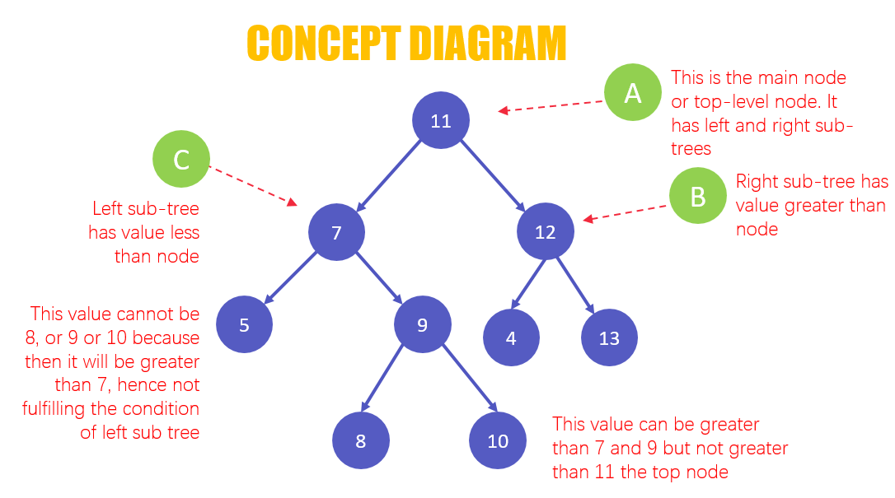
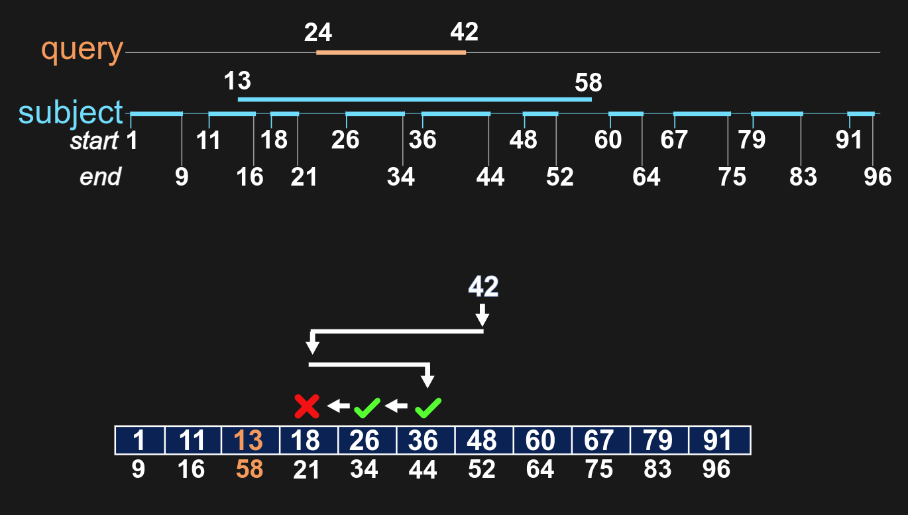
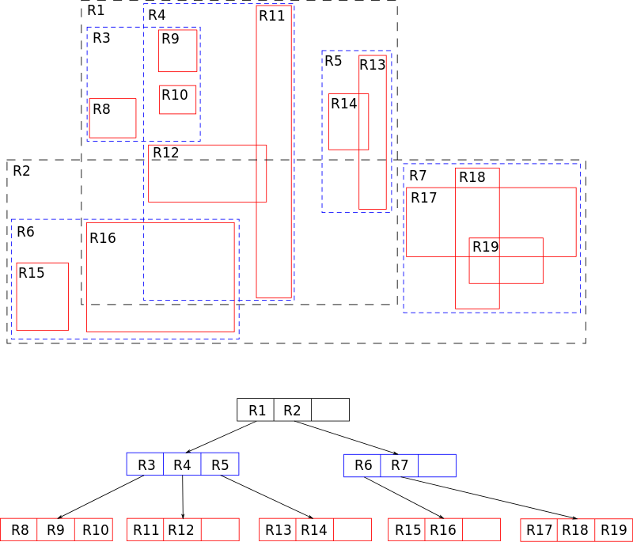
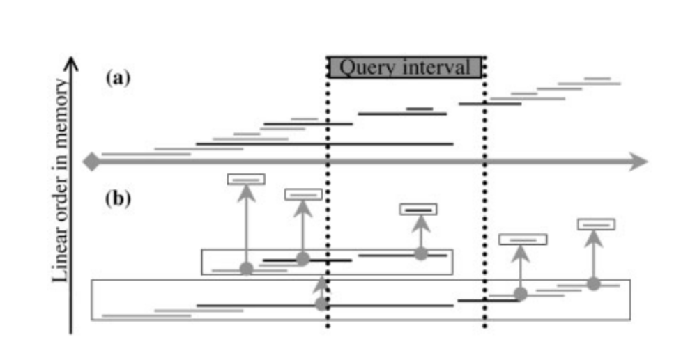
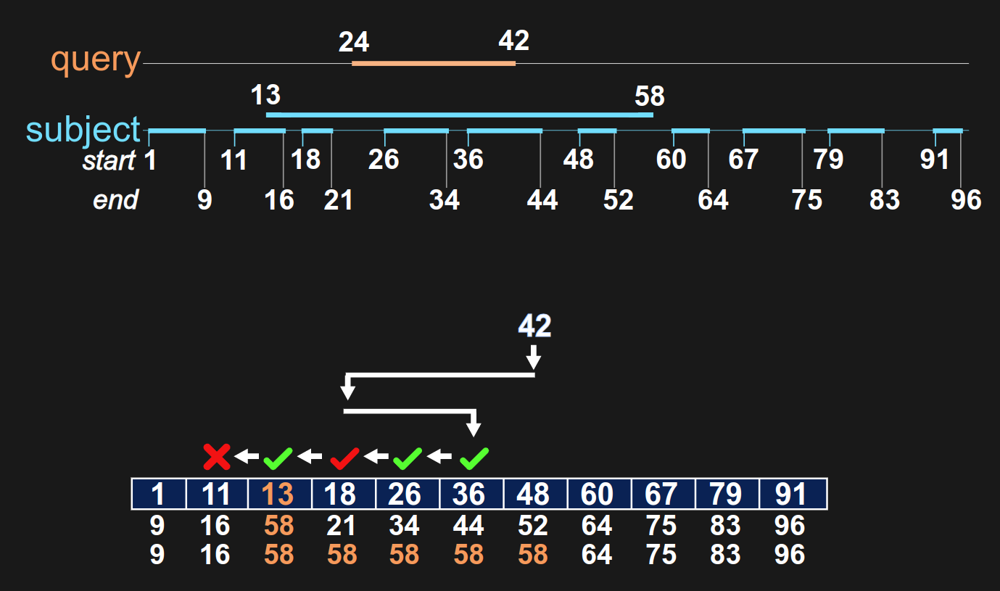

# Genomic Intervals: formats, data structures and algorithms

## Overview
Technological advances and lower sequencing costs have led to rapidly increasing epigenomic data generation, such as ChIP-seq and ATAC-seq experiments. This data can be used to dissect regulatory networks, annotate genetic variation, understand cellular differentiation, and more. Data from epigenome experiments is often presented as genomic intervals, which are then used for many types of downstream analysis. A **genomic interval** is a consecutive stretch on a genomic sequence defined by a start and end. 

## WHAT CAN BE REPRESENTED AS AN INTERVAL?
Because of the linear nature of DNA and RNA, many biological entities can be conceptualized as genomic intervals.

**ChIP-seq or ATAC-seq peaks:** The results of peak calling are intervals that were drived from the ChIP-seq or ATAC-seq experiments. Peak calling is a computational method used to identify areas in a genome that have been enriched with aligned reads as a consequence of ChIP-seq or ATAC-seq experiment. 

**Single-Nucleotide Polymorphisms (SNPs):** SNPs can be repersent as a interval of length of 1. 

**Genes and gene components:** Genes and other genomic components such as TSS, exons, introns, and transcripts can be represent as intervals defined by the their start and end possitions. 

**Non-coding DNA annotation:** Intervals can be used for non-coding DNA annatation. 


**Chromosomes:** Chromosomes can be represent as intervals define by the chromosome lengths (e.g. chromosome sizes file)

**Aligned sequence reads:** The locations of aligned reads resulted from any experiments can be represent as intervals. The interval representation can compress sequence data with sequence coordinates.

**Protein domains:** Protein domains can be represent as intervals on protein sequences (proteomic interval). 


Genomic intervals are often a simplified abstraction of genomic sequence. And, interval operations are fundamental in genomics.

## FILE FORMATS FOR GENOMIC INTERVALS
### BED 
BED (Browser Extensible Data) format provides a flexible way to define the data lines that are displayed in an annotation track. BED lines have three required fields and nine additional optional fields. 

#### The three required BED fields are:
**chrom -** The name of the chromosome (e.g. chr3, chrY, chr2_random) or scaffold (e.g. scaffold10671).

**chromStart -** The starting position of the feature in the chromosome or scaffold. (0-based vs 1-based coordinate system)

**chromEnd -** The ending position of the feature in the chromosome or scaffold. (open vs closed interval)

#### The 9 optional BED fields are:

**name -** Defines the name of the BED line. This label is displayed to the left of the BED line in the Genome Browser window when the track is open to full display mode or directly to the left of the item in pack mode.

**score -** A score between 0 and 1000. If the track line useScore attribute is set to 1 for this annotation data set, the score value will determine the level of gray in which this feature is displayed (higher numbers = darker gray). This table shows the Genome Browser's translation of BED score values into shades of gray:


**strand -** Defines the strand. Either "." (no strand) or "+" or "-".

**thickStart -** The starting position at which the feature is drawn thickly (for example, the start codon in gene displays). When there is no thick part, thickStart and thickEnd are usually set to the chromStart position.

**thickEnd -** The ending position at which the feature is drawn thickly (for example the stop codon in gene displays).

**itemRgb -** An RGB value of the form R,G,B (e.g. 255,0,0). If the track line itemRgb attribute is set to "On", this RBG value will determine the display color of the data contained in this BED line. NOTE: It is recommended that a simple color scheme (eight colors or less) be used with this attribute to avoid overwhelming the color resources of the Genome Browser and your Internet browser.

**blockCount -** The number of blocks (exons) in the BED line.

**blockSizes -** A comma-separated list of the block sizes. The number of items in this list should correspond to blockCount.

**blockStarts -** A comma-separated list of block starts. All of the blockStart positions should be calculated relative to chromStart. The number of items in this list should correspond to blockCount.

The number of fields per line must be consistent throughout any single set of data in an annotation track. The order of the optional fields is binding: lower-numbered fields must always be populated if higher-numbered fields are used. BED3 format only have the 3 required fields; BED6 have the additional name, score, and strand field. The BED format was initialy used for visilization in UCSC Genome Browser. The visulization related BED fields are: thickStart, thickEnd, itemRgb, blockCount, blockSizes, and blockStarts.

### NARROWPEAK (BED-like)

This format is used to provide called peaks of signal enrichment based on pooled, normalized (interpreted) data from experiments such as ChIP-seq and ATAC-seq. The ENCODE narrowPeak is a BED6+4 format. The 4 fields in addition to the BED6 format are:

**signalValue -** Measurement of overall (usually, average) enrichment for the region.

**pValue -** Measurement of statistical significance (-log10). Use -1 if no pValue is assigned.

**qValue -** Measurement of statistical significance using false discovery rate (-log10). Use -1 if no qValue is assigned.

**peak -** Point-source called for this peak; 0-based offset from chromStart. Use -1 if no point-source called.

### BROADPEAK (BED-like)

This format is used to provide called regions of signal enrichment based on pooled, normalized (interpreted) data. The ENCODE broadPeak is a a BED 6+3 format (without the **peak** filed in the narrowPeak format).

### GFF

All GFF (General feature format) formats (GFF2, GFF3 and GTF) are tab delimited with 9 fields per line. They all share the same structure for the first 7 fields, while differing in the content and format of the ninth field. Some field names have been changed in GFF3 to avoid confusion. For example, the "seqid" field was formerly referred to as "sequence", which may be confused with a nucleotide or amino acid chain. The general structure is as follows:

**seqname/seqid -** The name of the sequence. Must be a chromosome or scaffold.

**source -** The program that generated this feature.

**feature -** The name of this type of feature. Some examples of standard feature types are "CDS" "start_codon" "stop_codon" and "exon"li>

**start -** The starting position of the feature in the sequence.

**end -** The ending position of the feature.

**score -** A score between 0 and 1000. If the track line useScore attribute is set to 1 for this annotation data set, the score value will determine the level of gray in which this feature is displayed (higher numbers = darker gray). If there is no score value, enter ".".

**strand -** Valid entries include "+", "-", or "." 

**frame -** If the feature is a coding exon, frame should be a number between 0-2 that represents the reading frame of the first base. If the feature is not a coding exon, the value should be ".".

**group -** All lines with the same group are linked together into a single item.

## RELATED FILE FORMATS

**Wiggle** files and its **bedgraph** variant allow you to plot quantitative data as either shades of color (dense mode) or bars of varying height (full and pack mode) on the genome. 

### WIGGLE

Wiggle format is line-oriented. For wiggle custom tracks, the first line must be a track definition line (i.e., track type=wiggle_0), which designates the track as a wiggle track and adds a number of options for controlling the default display. Wiggle format is for continuous-valued data with constant size. 

**Fixed-step:** This format is used for data with regular intervals between new data values and is the more compact wiggle format. After the wiggle track definition line, fixed-step begins with a declaration line and is followed by a single column of data values. The declaration line starts with the word fixedStep and includes specifications for chromosome, start coordinate, and step size. The optional span parameter (default: span=1) allows data composed of contiguous runs of bases with the same data value to be specified more succinctly. The span begins at each chromosome position specified and indicates the number of bases that data value should cover.

*format:*


*example:*


**Variable-step:** This format is used for data with irregular intervals between new data points. After the wiggle track definition line, variable-step begins with a declaration line and is followed by two columns containing chromosome positions and data value. The declaration line starts with the word variable-step and is followed by a specification for a chromosome. The span specification has the same meaning as in fixed-step format. 

*format:*


*example:*


### BEDGRAPH

The bedGraph format allows display of continuous-valued data in track format. This display type is useful for probability scores and transcriptome data. 

*example:*


### WHY SO MANY FORMATS?

Different format can store the same data (wide vs tall structure). But based on the sparsity of the data, different format can store the data with different efficiency. Different format also store data with different processing level (raw signal vs. summary signal vs. regions)

## BIOLOGICAL QUESTIONS

Analysing genomic interval data can answer biological questions such as:

 - Is SNP *s* located in a promoter element? 
 - What is the nearest gene downstream of SNP *s*? 
 - What is the average distance to genes for SNP set *S*?
 - Which TF binding sites overlap region *r*?
 - Are binding sites of TF *y* enriched in enhancers?
 - How many sites of TF *y* are within 10 kb of gene *z*?
 - What is the shape of signal across interval set *I*?
 - What is the frequency of annotations for interval set *I*?
 - How many aligned reads mapped to gene *g*? (RNA-seq expression quantification)

## INTERVAL COMPUTATIONS

An **interval comparison** assumes a homology statement. A shared **coordinate system** is a prerequisite for interval comparison. Intervals with different reference genome assmebilies are not comparable.

### OVERLAP

Assuming the intervals are well-formed, which the position of start is less than the end ($X_{start} < X_{end}$), and the intervals are ordered by start ($A_{start} < B_{start}$)​, interval $A$ overlapping with $B$ if $A_{end} > B_{start}$


interval as set

### COUNTING OVERLAP 

To compute the degree of overlap, assuming there is no containment between interval $A$ and $B$:

$overlap = A_{end} − B_{start}$

or

$overlap = (A_{end} − B_{start}) − min(0,(A_{end} − B_{end}))$

### INTERSECTING REGION 

The intersecting region of interval $A$ and $B$, $R = A ∩ B$, where:

$R_{start} = max(A_{start}, B_{start})$
$R_{end} = min(A_{end}, B_{end})$

If $max(A_{start}, B_{start}) > min(A_{end}, B_{end})$, then interval $A$ and $B$ are not overlapping.

### UNION 

To identify the union of two intervals $A$ and $B$, first, we need to confirm they interset, $A ∩ B$. Then, $R = A ∪ B$, where:

$R_{start} = min(A_{start}, B_{start})$
$R_{end} = max(A_{end}, B_{end})$

### INTERVAL SET OVERLAP COUNTING

By counting the number of intervals in $\textbf{I}$ overlapping **q**, where $\textbf{I}$ is a set of intervals and **q** is the query interval, we can answer questionas such as the RNA-seq expression level of gene g
a set of intervals. We can do that by looping through the list of intervals:


However, we may have billions of intervals to loop through, which make $\textbf{O(N)}$ comparisons where N is the number of intervals. We can improve the performance with **binary search**:


## BINARY SEARCH

Binary search is a search algorithm that finds the position of a target value within a **sorted** array (ordered intervals). Binary search compares the target value to the middle element of the array (pivot). If they are not equal, the half in which the target cannot lie is eliminated and the search continues on the remaining half, again taking the middle element to compare to the target value, and repeating this until the target value is found. If the search ends with the remaining half being empty, the target is not in the array. Binary search runs in logarithmic time in the worst case, making $\textbf{O(log N)}$ comparisons, where $N$ is the number of elements in the array.


However, we can not do binary seach on a BED file with sorted regions because binary search also requires random access. It requires the ability to access any element directly. Indexing would provide random access to the file. 

## BINARY SEARCH TREES 

Binary search tree (BST) is a rooted binary tree data structure whose internal nodes each store a key greater than all the keys in the node's left subtree and less than those in its right subtree. Insertion in a sorted array is $O(N)$. BST have $\textbf{O(log N)}$ search and insertion, where N is the number of nodes. BST do not require random access for binary search.



### Hidden assumption for BST: No containment


There are advanced data structures that addressing the containment problem. 

## ADVANCED DATA STRUCTURES 
### B trees

The B-tree generalizes the binary search tree, allowing for nodes with more than two children. The node values of a B-tree are boundaries for subtrees, which provide overlap constraints. 


### R trees

The R-tree was proposed by Antonin Guttman in 1984. R-tree annotates tree nodes with a minimum bounding rectangle of elements. A query that does not intersect the bounding rectangle will not intersect any child element. R-tree is used by Bedtools for detecting overlaps.



### Nested containment lists (NClist)

A NClist is a datastructure that can be queried for elements overlapping intervals. It was invented and published by Alexander V and Alekseyenko Christopher J. Lee in Bioinformatics in 2007. The NClist internals rely on the observation that when a set of intervals, where all are non-contained (based on their interval bounds) in any of the other intervals in the set, are sorted on their start coordinate are also sorted on their end coordinate. If this requirement is fulfilled the items overlapping an interval can be found by a binary search on the query start and returning items until the query end coordinate has been passed, giving a complexity of $\textbf{O(log(N) + M)}$ where N is the size of the set and M is the number of overlaps. NClist is used by Bioconductor GenomicRanges class. 



### Augmented interval list (AIList)

An AIList is constructed by first sorting the interval set, R, as a list by the start coordinate, then decomposing it into a few approximately flattened components (sublists), and then augmenting each sublist with the running maximum interval end. The query time for AIList is $\textbf{O(log2N+n+m)}$⁠, where n is the number of overlaps between R and the query interval, q, N is the number of intervals in the set R and m is the average number of extra comparisons required to find the n overlaps.



## INTRO TO BIOCONDUCTOR GENOMIC RANGES

The GenomicRanges is a R/Bioconductor package that defines general purpose containers for storing and manipulating genomic intervals and variables defined along a genome.

To install `GenomicRanges`:
```
if (!require("BiocManager"))
    install.packages("BiocManager")
BiocManager::install("GenomicRanges")
```
To define a GRange object:
```
gr <- GRanges(
    seqnames = Rle(c("chr1", "chr2", "chr1", "chr3"), c(1, 3, 2, 4)),
    ranges = IRanges(101:110, end = 111:120, names = head(letters, 10)),
    strand = Rle(strand(c("-", "+", "*", "+", "-")), c(1, 2, 2, 3, 2)),
    score = 1:10,
    GC = seq(1, 0, length=10))
```

The components of the genomic coordinates within a GRanges object can be extracted using the `seqnames`, `ranges`, and `strand` accessor functions:

```
seqnames(gr)

## factor-Rle of length 10 with 4 runs
##   Lengths:    1    3    2    4
##   Values : chr1 chr2 chr1 chr3
## Levels(3): chr1 chr2 chr3

ranges(gr)

## IRanges object with 10 ranges and 0 metadata columns:
##         start       end     width
##     <integer> <integer> <integer>
##   a       101       111        11
##   b       102       112        11
##   c       103       113        11
##   d       104       114        11
##   e       105       115        11
##   f       106       116        11
##   g       107       117        11
##   h       108       118        11
##   i       109       119        11
##   j       110       120        11

strand(gr)

## factor-Rle of length 10 with 5 runs
##   Lengths: 1 2 2 3 2
##   Values : - + * + -
## Levels(3): + - *
```
GRanges objects can be devided into groups using the `split` method:
```
sp <- split(gr, rep(1:2, each=5))
sp

## GRangesList object of length 2:
## $`1`
## GRanges object with 5 ranges and 2 metadata columns:
##     seqnames    ranges strand |     score        GC
##        <Rle> <IRanges>  <Rle> | <integer> <numeric>
##   a     chr1   101-111      - |         1  1.000000
##   b     chr2   102-112      + |         2  0.888889
##   c     chr2   103-113      + |         3  0.777778
##   d     chr2   104-114      * |         4  0.666667
##   e     chr1   105-115      * |         5  0.555556
##   -------
##   seqinfo: 3 sequences from an unspecified genome
## 
## $`2`
## GRanges object with 5 ranges and 2 metadata columns:
##     seqnames    ranges strand |     score        GC
##        <Rle> <IRanges>  <Rle> | <integer> <numeric>
##   f     chr1   106-116      + |         6  0.444444
##   g     chr3   107-117      + |         7  0.333333
##   h     chr3   108-118      + |         8  0.222222
##   i     chr3   109-119      - |         9  0.111111
##   j     chr3   110-120      - |        10  0.000000
##   -------
##   seqinfo: 3 sequences from an unspecified genome
```

The `flank` method can be used to recover regions flanking the set of ranges represented by the GRanges object. So to get a GRanges object containing the ranges that include the 10 bases upstream of the ranges:
```
flank(g, 10)

## GRanges object with 4 ranges and 2 metadata columns:
##     seqnames    ranges strand |     score        GC
##        <Rle> <IRanges>  <Rle> | <integer> <numeric>
##   a     chr1   112-121      - |         1  1.000000
##   b     chr2    92-101      + |         2  0.888889
##   c     chr2    93-102      + |         3  0.777778
##   j     chr3   121-130      - |        10  0.000000
##   -------
##   seqinfo: 3 sequences from an unspecified genome
```

The `shift` method will move the ranges by a specific number of base pairs, and the `resize` method will extend the ranges by a specified width.
```
shift(g, 5)

## GRanges object with 4 ranges and 2 metadata columns:
##     seqnames    ranges strand |     score        GC
##        <Rle> <IRanges>  <Rle> | <integer> <numeric>
##   a     chr1   106-116      - |         1  1.000000
##   b     chr2   107-117      + |         2  0.888889
##   c     chr2   108-118      + |         3  0.777778
##   j     chr3   115-125      - |        10  0.000000
##   -------
##   seqinfo: 3 sequences from an unspecified genome

resize(g, 30)

## GRanges object with 4 ranges and 2 metadata columns:
##     seqnames    ranges strand |     score        GC
##        <Rle> <IRanges>  <Rle> | <integer> <numeric>
##   a     chr1    82-111      - |         1  1.000000
##   b     chr2   102-131      + |         2  0.888889
##   c     chr2   103-132      + |         3  0.777778
##   j     chr3    91-120      - |        10  0.000000
##   -------
##   seqinfo: 3 sequences from an unspecified genome
```

Between-range methods, such as `union` and `intersect`, calculate relationships between different GRanges objects.
```
g2 <- head(gr, n=2)
union(g, g2)

## GRanges object with 3 ranges and 0 metadata columns:
##       seqnames    ranges strand
##          <Rle> <IRanges>  <Rle>
##   [1]     chr1   101-111      -
##   [2]     chr2   102-113      +
##   [3]     chr3   110-120      -
##   -------
##   seqinfo: 3 sequences from an unspecified genome

intersect(g, g2)

## GRanges object with 2 ranges and 0 metadata columns:
##       seqnames    ranges strand
##          <Rle> <IRanges>  <Rle>
##   [1]     chr1   101-111      -
##   [2]     chr2   102-112      +
##   -------
##   seqinfo: 3 sequences from an unspecified genome
```

## REGION SET ENRICHMENT ANALYSIS

Given a query region set (e.g. result from a ChIP-seq experiment), region set enrichment analysis looks for the most similar region sets in previously published data.

### INTERVAL SIMILARITY METRICS
Measuring similarity between intervals:
- Overlap count
- Jaccard index (similarty of two sets) $\frac{A \cap B}{A \cup B}$
- Fisher's Exact Test (used in LOLA, [Sheffield and Bock 2016](https://academic.oup.com/bioinformatics/article/32/4/587/1743969?login=true))

### REGION SET ENRICHMENT ANALYTICAL TOOLS
- LOLA, [Sheffield and Bock 2016](https://academic.oup.com/bioinformatics/article/32/4/587/1743969?login=true)
  - Uses contingency table, and Fisher's Exact Test 
- GIGGLE, [Layer 2018](https://www.nature.com/articles/nmeth.4556)
  - Uses B+ tree, a B tree with nodes hold keys pointing to a linked list of values.
- IGD (Intergrated Genome Database), [Feng and Sheffield 2021](https://doi.org/10.1093/bioinformatics/btaa1062)
  - Uses a linear binning of an array

## CONCLUSION

Epigenomic data generation has rapidly increased, leading to large volumes of genomic intervals data. Genomic intervals are an extremely useful abstraction. Diverse biological questions can be asked using intervals. Dfferent data structures and algorithms enable large-scale genomic interval analysis. And, new methods for genomic intervals are being developed. 


## TERMINOLOGY
- **interval**: a location on a sequence defined by a start and end
- **region**: often used as a synonym of interval (biological context, regions of genome)
- **chromosome**: In the context of genomic intervals, chromosome is often used to indicate the name of the sequence on which an interval is defined, but this is really a fudging, use chromosme to refere the interval = sequence name 
- **interval set (region set)**: a collection of intervals/regions, result of ChIP-seq exp is a interval set
- **coordinate system**: a set of sequence names and lengths
- **intersection**: intersection of two interval A and B is the region which is common to both A and B
- **union**: union of two interval A and B consists of all regions belonging to either A or B
- **overlap**: Two regions that are overlapping if they have interecting region


