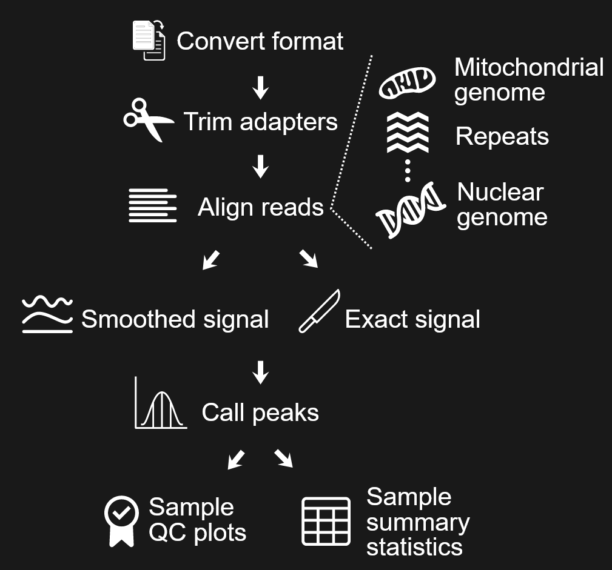
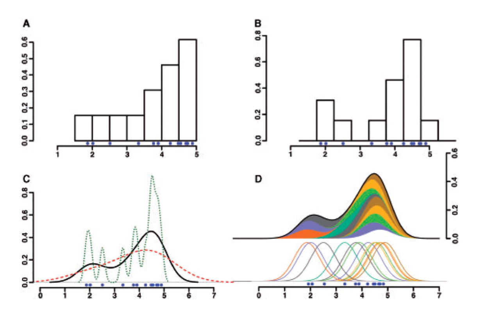
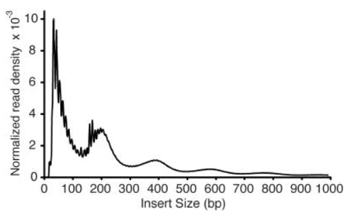
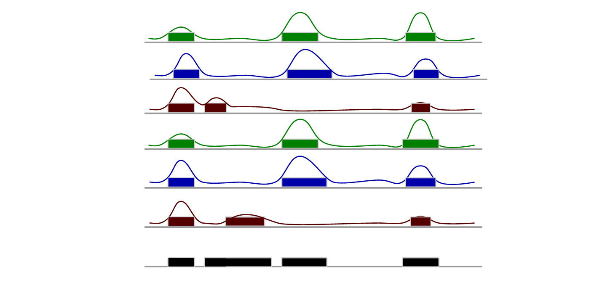
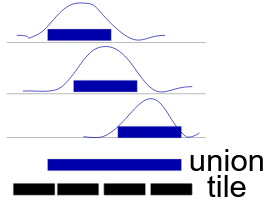
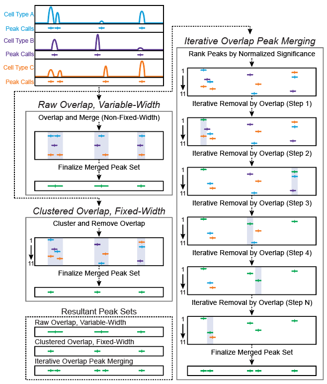
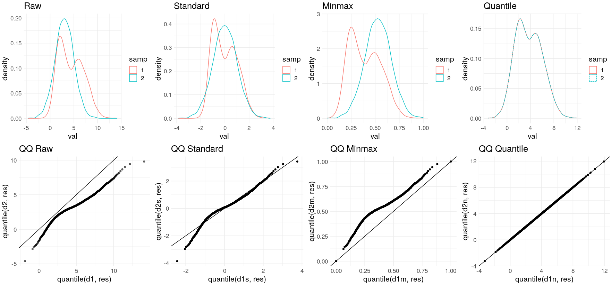

# ATAC-seq diagnostics and harmonization

## ATAC-seq Overview

### What's ATAC-seq?

The assay of transposase accessible chromatin (ATAC-seq) uses hyperactive Tn5 transposase to simultaneously cut and ligate adapters for high-throughput sequencing at regions of increased accessibility. Genome-wide mapping of insertion ends by high-throughput sequencing allows for multidimensional assays of the regulatory landscape of chromatin with a relatively simple protocol that can be carried out in hours for a standard sample size of 50,000 cells. ([Buenrostro et al. 2016](https://www.ncbi.nlm.nih.gov/pmc/articles/PMC4374986/))

### Tn5 transposase

The ATAC-seq methodology relies on library construction using the hyperactive transposase Tn5. Tn5 is a prokaryotic transposase, which endogenously functions through the “cut and paste” mechanism, requiring sequence-specific excision of a locus containing 19 base-pair inverted repeats. Tn5 transposase used in ATAC-seq are loaded with sequencing adapters which create an active dimeric transposome complex. Engineered Tn5 transposase harbors specific point mutants to the Tn5 backbone which significantly increases activity. Such transposase preferentially inserts sequencing adapters into unprotected regions of DNA, therefore acting as a probe for measuring chromatin accessibility genome-wide.

### Advantages against other technologies

The biggest advantage of ATAC-seq is that it requires **less material** and requires **less preparation time**.

Other methods for assaying chromatin structure and composition such as MNase-seq , ChIP-seq and DNase-seq often require tens to hundreds of millions of cells as input material, averaging out heterogeneity in cellular populations. In many cases, rare and important cellular sub-types cannot be acquired in amounts sufficient for genome-wide chromatin analyses. 

### Difference between ATAC-seq and ChIP-seq

ChIP-seq

* uses an antibody
* selects a specific factor
* identifies fragments

ATAC-seq

* no antibody
* all factors
* identifies nucleotides

ATAC-seq identifies nucleotides instead of fragments thus loses specificity compared with ChIP-seq.

## Basic Algorithm for Sequence-Based Genome Data

### Basic Workflow

* Reads can be aligned to mitochondrial genome and nuclear genome separately for filtering.

* DNA is cut off by two transposases. Repair of sticky ends cut by Tn5 transposases induces 9bp duplication on the sides. Trim 4bp from 5' end and 5bp from 3' end to correct this.

### ATAC-seq Peak Calling

* [Macs2](https://pypi.org/project/MACS2/) (https://pypi.org/project/MACS2/)

* [SICER](https://github.com/zanglab/SICER2) (https://github.com/zanglab/SICER2)

* [F-seq](https://fureylab.web.unc.edu/software/fseq/) (https://fureylab.web.unc.edu/software/fseq/)

F-seq uses univariate kernel density estimation (kde) to infer the pdf and the smoothness of the density estimates can be controlled by setting the bandwidth.
  

### QC Metrics

Pre-alignment

* Fastqc

Post-alignment

* TSS Enrichment Score

The idea behind the TSS enrichment score metric is that ATAC-seq data is universally enriched at gene TSS regions compared to other genomic regions, due to large protein complexes that bind to promoters. It was also found that TSS enrichment to be representative across the majority of cell types tested in both bulk ATAC-seq and scATAC-seq ([ArchR](https://www.archrproject.com/bookdown/index.html)). 

1. Collect a reference set of TSSs
2. Aggregate reads 2000 bp around TSSs
3. Tile into 100bp windows
4. $S_{TSS} = \frac{TSS}{background}$

* Fragment distribution

  Typically, a successful ATAC-seq experiment should generate a fragment size distribution plot with decreasing and periodical peaks corresponding to the nucleosome-free regions (NFR) (< 100 bp) and mono-, di-, and tri-nucleosomes (~200, 400, 600 bp, respectively) ([Yan et al. 2020](https://genomebiology.biomedcentral.com/articles/10.1186/s13059-020-1929-3))

## Harmonization

To answer biological questions for chromatin analysis we need to compare samples. The harmonization steps transform data so as to make them more comparable. Two or more datasets can be normalized to each other or to an independent reference, it depends on the data.

### Problem 1: Peak locations differ across samples

Possible solution: Consensus peaks

Approaches to get consensus peaks:

* Union: simply merge all the peaks into one

  * Union doesn't work for many samples, especially for heterogeneous samples.

  

* Union-tile: Divide the whole genome into tiles evenly and project peaks from different samples to the tile array.

  * Union tile increases resolution, but also increases compute time.

  * Tile boundaries are artificial and may split meaningful units.

  

* Iterative overlap

  * Peaks are first ranked by their significance. The most significant peak is retained and any peak that directly overlaps with the most significant peak is removed from further analysis. Then, of the remaining peaks, this process is repeated until no more peaks exist. This avoids daisy-chaining and still allows for use of fixed-width peaks.
  * This algorithm avoids many issues of the first two methods.

  

With consensus peaks, peak accessibility matrix could be filled by extracting score from signal track (.wig) or aligned reads (.bam).

Matrix values could be:

* Number of reads aligned
* Maximum height of signal curve
* Area under the curve (sum of signal curve)

### Problem 2: Sequencing depth normalization

Reads per Kilobase per Million (RPKM) is usually used to normalize RNA-seq data. For ATAC-seq, we need to consider both the region width (fixed vs variable) and data type (raw read counts vs. model signal track). It also needs to be noted that sample-specific peaks are usually **low-accessible**.

**ATAC-seq normalization approaches:**

* Standard normalization

  * $x^{\prime} = \frac{x-\mu}{\sigma}$
  * Centers: puts data around the mean
  * Scales: puts data on the same range
  * Result is standard deviations away from the mean
  * Doesn't change the shape of a distribution

* MinMax scaling: Sets all data on a scale from 0-1

  * $x^{\prime}=\frac{x−x_{min}}{x_{max}−x_{min}}$
  * Makes data interpretable:  1= highly open; 0= closed
  * Accessibility matrix can be normalized on both axes, to compare samples or regions.

* Quantile normalization

  * Assumes sample distributions should be the same. Forces them to look identical.

  * Given reference distribution *R*, first rank sample data points $a_i \in A$, then set the value of $A_r$ to $R_r$, for each rank *r*. So, the highest a assumes the highest value in *R*, the 2nd highest *a* assumes the 2nd highest in *R*, *etc.*

### Quantile-quantile plots

The quantile-quantile (q-q) plot is a graphical technique for determining if two data sets come from populations with a common distribution.

A q-q plot is a plot of the quantiles of the first data set against the quantiles of the second data set. By a quantile, we mean the fraction (or percent) of points below the given value. That is, the 0.3 (or 30%) quantile is the point at which 30% percent of the data fall below and 70% fall above that value. 

A 45-degree reference line is also plotted. If the two sets come from a population with the same distribution, the points should fall approximately along this reference line. The greater the departure from this reference line, the greater the evidence for the conclusion that the two data sets have come from populations with different distributions. 

Examples:

* On q-q plot, a curve formed by points indicating different distributions.

* Standard and MinMax normalizations tend to keep the shapes of raw distributions.

* Quantile normalization always returns an average distribution, so points are on the diagonal.

  

* MinMax scaling is highly influenced by outliers.
* Trim extreme data is a way to handle outliers ( clip function: *x=min(x,quantile(x,0.99))* )

## Batch effect

In molecular biology, a **batch effect** occurs when non-biological factors in an experiment cause changes in the data produced by the experiment. Such effects can lead to inaccurate conclusions when their causes are correlated with one or more outcomes of interest in an experiment. They are common in many types of high-throughput sequencing experiments, including those using microarrays, mass spectrometers, and single-cell RNA-sequencing data. They are most commonly discussed in the context of genomics and high-throughput sequencing research, but they exist in other fields of science as well. ([wikipedia](https://en.wikipedia.org/wiki/Batch_effect))

It must be noted that **normalization doesn't equal batch correction.** 

Normalization adjusts global properties of measurements for individual samples so that they can be more appropriately compared. Normalization does not remove batch effects, which affect specific subsets of genes and may affect different genes in different ways. ([Leek et al. 2010](https://www.nature.com/articles/nrg2825))

### Sources of batch effects

Sources of batch effects include:

- experimental conditions
- different protocols
- different labs
- different technicians
- sequencing equipment
- lane in a sequencer
- day of the week
- reagent lots

### Batch correction approaches

* Known batch effects can be revealed using PCA, clustering and individual feature plots

* If batches are known, tools such as ComBat could be applied to remove the effects.
* If batches are unknown, we should remove everything else than biological signal. 
* [Surrogate variable analysis](https://journals.plos.org/plosgenetics/article?id=10.1371/journal.pgen.0030161) is an example of unknown batch correction. The idea is:
  1. Remove signal of variable of interest from data.
  2. Decompose the residual matrix to identify vectors with more variation than expected by chance (permutation test).
  3. Identify the subset of genes driving each vector. 
  4. For each subset of genes, build a surrogate variable based on the original expression data.
  5. Include surrogate variables as covariates in subsequent analyses.

Confounding here is when technical batches coincide with biological interest. So avoid this situation when doing the experiment.
